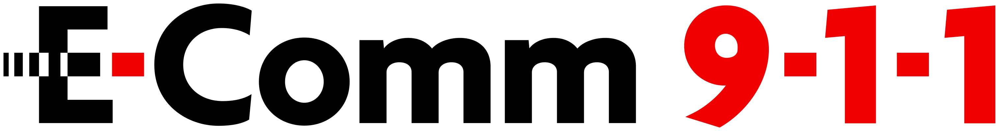
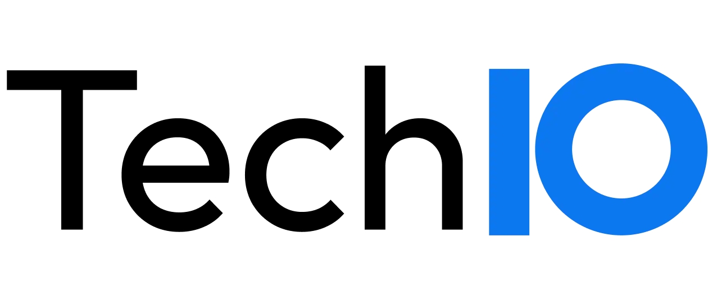
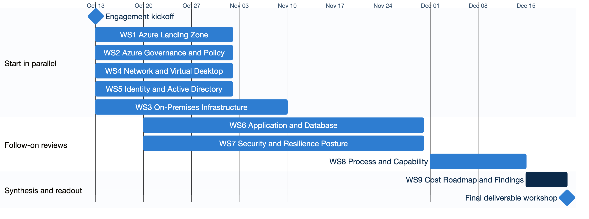

<!-- _class: title -->
<!-- _paginate: false -->

# Phase 1 Discovery Kickoff

### E-Comm 9-1-1 Cloud Migration

 

TechIO Tuesday, October 13, 2026

---

<!-- _class: agenda -->

## Agenda

1. Introductions
2. Why this program
3. Phase 1 Discovery Workstreams and Owners
4. Phase 1 Discovery timeline
5. Phase 1 Discovery deliverables
6. Discovery approach
7. Success criteria
8. Governance and communication cadence
9. Access and readiness
10. Confirming our next steps and Q&A

---

<!-- _class: team -->

## TechIO introduction

| TechIO | Role |
|---|---|
| Munish Saldhi (Executive Sponsor) | Program Director |
| Sidhartha Thapar (Executive Sponsor) | Delivery Head |
| Ahmad Obay | Technical Lead |
| Naga Srivatsa | Identity Specialist |
| Dinakara Kaushik Dhulipala | Cloud Engineer |
| Vishwa Isola | Technical Program Manager |
| Phillip Basran | PMO Lead |
| Yaroslav Morkvin | Principal Architect |

> Decision authority
>
> - **Operational:** Technical Program Manager
> - **Technical direction:** Technical Lead
> - **Scope and acceptance:** Executive Sponsor

> Escalation path
>
> - **L1:** Technical team, with the E-Comm 9-1-1 workstream SME
> - **L2:** Project Manager, with the E-Comm 9-1-1 Project Manager
> - **L3:** Executive Sponsors, both sides

---

<!-- _class: team -->

## E-Comm 9-1-1 introduction

| E-Comm 9-1-1 | Role |
|---|---|
| Tony Gilligan (Executive Sponsor) | VP Technology |
| Jennifer Strutt (Project Sponsor) | Director, Technology Services |
| Jeremy Wong | Project Manager |
| Darryl Tourond | Program Manager (TSTx) |
| Tom Ly | Business Analyst |

> Decision authority
>
> - **Operational:** Project Manager
> - **Scope and acceptance:** Executive Sponsor

> Escalation path
>
> - **L1:** Workstream SME, with the TechIO technical team
> - **L2:** Project Manager, with the TechIO Project Manager
> - **L3:** Executive Sponsors, both sides

---

<!-- _class: why -->

## Why this program

*Modernizing the environment to sustain the service levels E-Comm 9-1-1 requires.*

- **Out-of-support systems**
  A planned path to supported platforms
- **Security exposure**
  Patch levels brought to current standards
- **Business continuity**
  Stronger recovery capability
- **Site-independent resilience**
  No reliance on any single site
- **Cloud operating benefits**
  Operational excellence on Azure
- **Skills and capability**
  Processes and skills for hybrid operations

<!--
Opening: E-Comm 9-1-1's current environment has reached a point where modernization is needed to sustain the service levels the organization requires. Phase 1 develops a clear, shared understanding of each area on this slide, using read-only access. Remediation is planned for later phases.

Out-of-support systems: a significant part of the estate is approaching or has reached vendor end of support, and needs a planned path to supported platforms.

Security exposure: bringing patch levels across the estate up to current standards is a priority to reduce exposure to known vulnerabilities.

Business continuity: service delivery is closely tied to the primary data center, and recovery capability needs to be strengthened.

Site-independent resilience: critical services need greater redundancy so they can continue to operate independently of any single site.

Cloud operating benefits: moving to Azure brings operational excellence, on-demand scalability, built-in security and resilience, and clearer cost visibility and control.

Skills and capability: operating a hybrid environment calls for updated processes and skills, building on the team's existing on-premises expertise.
-->

---

<!-- _class: ws -->

## Phase 1 Discovery Workstreams and Owners

| WS # | Workstream | E-Comm 9-1-1 | TechIO |
|---|---|---|---|
| WS1 | Azure Landing Zone Review | Harshith Pingili, Bahram Maleki | Ahmad Obay, Dinakara Dhulipala |
| WS2 | Azure Governance and Policy Compliance | Harshith Pingili, Bahram Maleki | Naga Srivatsa, Ahmad Obay |
| WS3 | On-Premises Infrastructure Discovery | Kevin Gilmore, Michael Day | Ahmad Obay, Dinakara Dhulipala |
| WS4 | Network, Connectivity and Virtual Desktop Review | Saqib Mahmood, Bahram Maleki | Ahmad Obay, Yaroslav Morkvin |
| WS5 | Identity and Active Directory Review | Darren Grant, John Christensen | Naga Srivatsa |
| WS6 | Application, Product, Vendor and Database Review | Kevin Gilmore, Ken Garces | Ahmad Obay, Dinakara Dhulipala |
| WS7 | Security, Resilience and Recovery Posture Review | John Christensen, Kevin Gilmore | Ahmad Obay, Yaroslav Morkvin |
| WS8 | Process and Capability Assessment | Kevin Gilmore, Darren Grant | Ahmad Obay |
| WS9 | Cost, Roadmap, Findings Synthesis and Executive Readout | Jeremy Wong, Tom Ly | Ahmad Obay |

---

<!-- _class: figure -->

## Phase 1 Discovery timeline

*Phase 1 Discovery runs for ten weeks, from October 13 to December 21, 2026. The contractual delivery window is twelve weeks, to January 5, 2027.*

---

<!-- _class: deliver -->

## Phase 1 Discovery deliverables

| # | Report | What E-Comm receives | SOW ref |
|---|---|---|---|
| 1 | Azure Landing Zone and Governance Review Report | Current-state review, policy and governance posture, a reuse, remediate or rebuild recommendation, and a remediation backlog. | D01, D02 |
| 2 | Identity and Active Directory Review Report | Directory and authentication architecture, cloud-integration readiness, and dependencies. | D05 |
| 3 | Application and Infrastructure Discovery, Rationalization and Cost Estimation Report | Consolidated inventory, dependency map, a disposition for each workload, and a cost estimate for the target Azure hosting. | D03, D06 |
| 4 | Network and Connectivity Review Report | Topology, segmentation, hybrid connectivity, addressing, and multicast and UDP dependencies. | D04 |
| 5 | Virtual Desktop Review Report | Citrix baseline, Azure Virtual Desktop suitability, exceptions, and transition recommendations. | D04 |

---

<!-- _class: deliver -->

## Phase 1 Discovery deliverables

| # | Report | What E-Comm receives | SOW ref |
|---|---|---|---|
| 6 | Security Posture Review Report | Legacy exposure, patch and vulnerability posture, and prioritized follow-up actions. | D07 |
| 7 | Resilience and Recovery Review Report | High availability and disaster recovery posture for each application, against business-defined RPO and RTO. | D07 |
| 8 | Operating Model and Capability Review Report | Current operating model, skills review, and the capabilities needed to run the target environment. | D08 |
| 9 | Consolidated Findings, Roadmap and Cost Report | Executive-level consolidation of reports 1 to 8. | D09 |
| 10 | Executive Readout Presentation | Presentation of report 9, with next-phase scoping inputs and the recommended engagement structure. | D10, D11 |

*Reports 9 and 10 are handed over together at the executive readout.*

---

<!-- _class: map -->

## How the reports map to the Statement of Work

| SOW | Statement of Work deliverable | Timeline |
|---|---|---|
| D01 | Azure Landing Zone Review Report  | Nov 2 |
| D02 | Azure Governance and Policy Discovery Baseline  | Nov 2 |
| D03 | Validated Infrastructure Inventory and Classification  | Nov 10 |
| D04 | Network, Connectivity and Virtual Desktop Review  | Nov 2 |
| D05 | Identity and Active Directory Review  | Nov 2 |
| D06 | Application, Product, Vendor and Database Review  | Nov 30 |
| D07 | Security, Resilience and Recovery Posture Review  | Nov 30 |
| D08 | Operating Model, Capability and Knowledge Transfer Baseline  | Dec 15 |
| D09 | Consolidated Phase 1 Findings, Roadmap and Cost Review  | Dec 21 |
| D10 | Executive Readout Presentation  | Dec 21 |
| D11 | Next-Phase Scoping Inputs and Recommended Engagement Structure  | Dec 21 |

---

<!-- _class: steps -->

## Discovery approach

WS1, WS2, WS3, WS6 and WS9 are delivered through the steps below.

1. **Consolidate the inventory** from RVTools, Azure Migrate, Dr. Migrate and the E-Comm inventory export.
2. **Identify the applications** running on each server and the business value each one provides.
3. **Validate with the owners** through a questionnaire and an interview with each application owner.
4. **Map the dependencies** between applications, databases and other systems.
5. **Rationalize** each workload into a disposition: retire, retain, rehost, replatform or rebuild.
6. **Define the target** hosting for each workload that moves to Azure.
7. **Estimate the cost** of the target hosting.

*WS4, WS5, WS7 and WS8 each have their own individual review, with findings consolidated into WS9.*

---

## Success criteria

At the close of Phase 1, E-Comm knows:

- **Where the estate stands today:** validated findings, risks and dependencies across the current environment.
- **What is being built:** a disposition and target direction for each workload.
- **What it will cost:** a directional estimate for the target Azure hosting.
- **How long it will take:** an indicative roadmap for the phases that follow.

---

<!-- _class: gov -->

## Governance and communication cadence

| Mechanism | Cadence | Purpose |
|---|---|---|
| Weekly status review | Twice a week, Tuesday and Thursday at 10 am (1 hour) | Progress, findings to date, risks, dependencies and decisions required. |
| Weekly status report | Weekly, Tuesday morning, covering the previous week | Project status and executive summary, milestones, work completed, and work planned for the next week. |
| PM cadence with E-Comm counterpart | Once a week | Project-level alignment between the TechIO Project Manager and the E-Comm counterpart. |
| Steering committee | Monthly | Executive stakeholders on both sides are updated on status and aligned in person. |
| Discovery workshops | As required | Working sessions with E-Comm owners to gather and validate findings. |
| Workstream checkpoints | As each workstream closes | Each workstream is reviewed with its E-Comm owners. |
| Architecture alignment | As required | Alignment on architecture topics and decisions. |

---

## Access and readiness

### In place

- Azure reader, security reader and cost management access; Azure Migrate and Dr. Migrate.
- Citrix and management server access; Azure DevOps repositories.
- Project documentation and the inventory list in the hybrid cloud SharePoint.
- AD FS configuration and certificate services exports.
- Microsoft on-demand assessments for the directory review, led by E-Comm 9-1-1 subject matter experts with TechIO support.

---

<!-- _class: next -->

## Confirming our next steps

### Launch the discovery workstreams

Confirm owners and readiness to start workstreams 1 to 5 in parallel on October 13.

### Establish the delivery cadence

Confirm the weekly status review (Tuesday and Thursday, 10 am) and owners for outstanding access items.

---

<!-- _class: lead statement -->
<!-- _paginate: false -->

# Q&A
