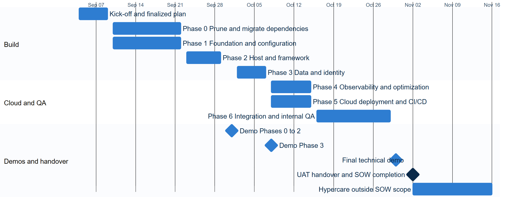

<!-- _class: title -->
<!-- _paginate: false -->

# MASC Client.Api Modernization

 

TechIO Friday, October 16, 2026

---

<!-- _class: agenda -->

## Agenda

1. **Introductions**
2. **Project Phases & Key Deliverables**
3. **Modernization Approach & Agents**
4. **Humans in the Loop & Governance**
5. **The Loop: Prompts → Outputs → Refinement**
6. **Reviews, Parity & Security**
7. **Progress, Timeline & What's Next**

---

<!-- _class: team -->

## Introductions

| TechIO | Role |
|---|---|
| Sparsh Dutta | Tech Lead, also performs QA checks |
| Dinakara Kaushik Dhulipala | Senior DevOps Engineer |
| Vishwa Isola | Technical Program Manager |
| Munish Saldhi (Executive Sponsor) | Director of Business Development and Customer Success |

> Decision authority
>
> - **Operational:** TPM
> - **Technical direction:** Tech Lead
> - **Scope and acceptance:** Executive Sponsor

> Escalation path
>
> - **L1:** Technical team ↔ workstream SME
> - **L2:** Project Manager ↔ Tech Lead
> - **L3:** Executive Sponsors, both sides

---

<!-- _class: phases -->

## Project Phases & Key Deliverables

| Phase | Description | Status | Key Activities |
|---|---|---|---|
| Phase 0 | Dependency Pruning | Complete | Removed dead references; migrated legacy dependencies to .NET 10 |
| Phase 1 | Foundation & Config | Complete | New Client.Api foundation, scaffolded with dependency injection and modern config and secrets |
| Phase 2 | Host & Framework | Complete | Hosting migrated to Kestrel/ASP.NET Core; routing and controllers preserved |
| Phase 3 | Data & Identity | Complete | EF6 migrated to EF Core 10; ADAL retired for MSAL; token parity validated |
| Phase 4 | Observability | Complete | Performance checks; Azure Monitor and App Insights integrated |
| Phase 5 | Cloud Deployment | Complete | CI/CD, secrets and monitoring wired up; staging deployment complete |
| Phase 6 | Integration & QA | Complete | Full integration testing, security scan and documentation complete |
| Phase 7 | UAT Handover | Not Started | UAT execution and sign-off; handover to MASC |

---

<!-- _class: why -->

## Modernization Approach

- **Agents & skills**
  A specialized agent for each job, not one black box
- **Human-gated**
  TechioSoft's Tech Lead makes every risky call
- **Stage gates**
  Nothing risky merges without passing a gate
- **Iterative loop**
  Prompt, output, refine. Every step leaves an artifact
- **Cloud-ready**
  Hardened security, ready for Azure deployment
- **Ahead of plan**
  34% faster, with demo and sign-off remaining

<!--
Specialized agents build; the TechioSoft Tech Lead decides every risky call.
This slide previews the agenda. Each card maps to one of the six sections that follow.
-->

---

<!-- _class: steps -->

## Agents

Two .NET agents carry the work, in order.

1. **.NET Discovery Agent:** analyzes the legacy app and produces the endpoint inventory and slicing plan.
2. **.NET Modernizing Agent:** turns that plan into reviewed code, one unit at a time, not a black box.

### How the Modernizing Agent works

- **Input:** the slicing plan and endpoint inventory from the Discovery Agent.
- **Process:** the Modernization Lead orchestrates the build, test and self-healing fix loop, without writing production code itself.
- **Output:** a reviewable PR for every stage; the TechioSoft Tech Lead reviews and approves before anything merges.

---

<!-- _class: ws -->

## Modernizing Agent Skills in Detail

**Modernization Lead's** four skills, each with a guardrail and a TechIO review.

| Skill | What it does | Guardrail built in | What TechIO reviews |
|---|---|---|---|
| State Tracker | Single source of truth for 14 slices; powers the live dashboard. | Validation gate enforces slicing rules R1–R10. | Live progress dashboard |
| Branch & PR Orchestrator | One branch/PR per stage; runs the self-healing build loop. | No silent commits; up to 5 fix retries, then a draft PR with the failure log. | PR summary, test and parity reports, self-healing log, state diff |
| Vertical Slice / Parity Validator | Generates and checks each slice end to end, domain to web and tests. | One owner per slice, with parity sign-off. | Parity report for each slice |
| Security Review | Scans code and dependencies for vulnerabilities. | Gate in the workflow; security changes need a human to merge. | Scan findings, e.g., a CVE-pinned Graph dependency |

---

<!-- _class: steps -->

## Humans in the Loop

People make the risky calls. Agents do the repeatable work.

1. **Tech Lead prompts:** the TechioSoft Tech Lead sets the intent for each stage.
2. **Agents build:** branch, code, tests and the self-healing loop.
3. **Tech Lead approves:** the TechioSoft Tech Lead reviews the PR and parity reports.
4. **MASC reviews:** MASC reviews the PR and demo, and confirms parity before Phase 4.

---

## Good Practices We Followed

- One branch and one PR per stage. Nothing merges to main until UAT passes.
- Golden master captured on .NET 4.8 before any code changes.
- We work inside MASC's environment: your VM, Azure DevOps repos and Dev database.
- MASC confirms data parity in Dev before deployment to test, ahead of final UAT.

---

<!-- _class: cards3 -->

## Stage Gates & Governance

Database and security changes are gated to the TechioSoft Tech Lead.

- **Phase gates (L0–L5)**
  Foundation must be green before feature work begins
- **Slicing rules (R1–R10)**
  Small, reviewable changes with a full audit trail
- **Human gates (L3)**
  Data parity and live-Azure steps need TechioSoft sign-off

---

<!-- _class: next -->

## The Loop: Prompts → Outputs → Refinement

Human intent in, reviewed change out, iteratively. It's a conversation: the Tech Lead asks, the agent produces a reviewable PR, and we refine. Every step leaves a documented artifact.

### Prompt

"Port the 20 controllers to ASP.NET Core."

### Output

20 controllers migrated, with 59 endpoints reconciled 1:1 with the legacy app.

### Refinement

Review caught runtime parity bugs a green build missed (model binding and ambiguous routes), and they were fixed.

### Artifacts produced along the way

Endpoint inventory · contract-parity test harness · live progress dashboard · access checklist · local-run guide

---

<!-- _class: stats -->

## Reviews & Quality: Real Bugs Caught

AI review and real-data testing found what compilers couldn't. These are subtle behavioral bugs that would have hit production, caught early by actually running the app, not just compiling it.

<ul>
<li>8EF6 → EF Core parity bugsSurfaced by running the modern app against the real database, all fixed</li>
<li>6Self-healing fix cycles100% converged, averaging 2 iterations</li>
<li>2Runtime-only defectsAn independent code-review agent caught defects a passing build hid</li>
<li>22EndpointsThe modern API now returns real client data from the Dev database</li>
</ul>

---

<!-- _class: stats -->

## Parity Check Report

We selected 59 endpoints for parity testing against the real Dev database. Out of those 59, here are the results.

<ul>
<li>59Endpoints testedLive against real data, every endpoint exercised</li>
<li>57/59Verified greenAll 32 High and 13 Medium priority endpoints pass</li>
<li>11Bugs found & fixedEF Core port issues caught only by running real data</li>
<li>0Open defectsRemaining 2 are low-priority, email-triggering endpoints, held for the test environment</li>
</ul>

---

## Security Scan

<!--
Placeholder slide. Content to be added.
-->

---

<!-- _class: next -->

## Progress & What's Next

Application code is feature-complete and deployed; demo and sign-off remain.

### Done & merged

Modern host with 20 controllers and dependency injection, the EF Core data layer, authentication (S13), and observability.

### Parity testing

The modernized app runs today against the real Dev database and returns real data.

### Human-gated next

Data-parity sign-off · live-token auth validation · client demo · security scan.

---

<!-- _class: figure -->

## Project Timeline

*Ahead of plan: full test environment deployment and handover targeted for October 13. AI agents cut our timeline by 34%: 34 planned business days down to 23.*

CompletePlannedAccelerated target date

<!--
How the percentage is calculated: the plan's build work (Phase 0 start Sep 10 to Phase 6 end Oct 29)
is 34 business days (BC statutory holidays excluded). Completing all work by Oct 10 is 21 business
days: 1 - 21/34 = 38%. Calendar days give the same result: 31 vs 50 days. If demo and UAT handover
(Nov 2) were counted in the baseline, it would be 42%.
Note: the source deck's headline states 34%, but this note computes 38%, and the body text names
both Oct 10 and Oct 12 as the target date; confirm which figures to use before presenting.
-->

---

<!-- _class: lead statement -->
<!-- _paginate: false -->

# Thank You

### Questions and discussion
